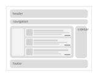

# Web Development Introduction - Assignment

## Setup

Please refer to the [setup](./SETUP.md) section.

## Assignments

### HTML Assignment

The goal of this HTML assignment is the creation of ficitive blog homepage. Use the existing HTML document, remove everything you don't need and start from there.

You don't have to implement any page other than the blog start page.

The blog homepage should contain the following items:

* A list of blog post teasers.  
  Be creative and just invent a couple of topics or use lorem ipsum.
* Each teaser should consist of an image, a title, a short description and a link to a detail page (you don't have to implement a detail page!).
* The blog hompage needs a catchy headline.
* Add a navigation with navigation items that lead to other fictitious sections of the blog (don't build those pages).
* The blog homepage should have a footer that holds meta information for the blog

For sample images you can use a service like placeholder.com:  

```html

```


Sample texts can be created via <https://loremipsum.de/>.

__Always keep the semantics of your homepage in mind!  
HTML provides a lot of building blocks that you can use to properly define the elements of your website.__

_Formatting and styling is not part of this assignment! Only concentrate on the pure HTML based document structure._

### CSS Assignment

* Use CSS to style the blog homepage that you have created in the previous assignment.  
  Set `color`s, `font-size`s and `font-family`s to your liking and assign proper spacings to adjacent elements using `padding`s and `margin`s. Utilize `border`s and `background-color`s to offset elements from each other.  
  There are also a couple of interesting CSS features like `box-shadow`, `border-radius`, `text-shadow`, `border-image`, why not try some of these?

* Introduce a sidebar with some (fictitious) blog related content, for example the latest comments, most important tags for the blog, most read blog posts and so on.

* The sidebar should be positioned on the side of the list of blog posts

This sketch represents a possible structure of how your blog home page might look like. This is not a specification but merely a mental model to help you getting a better feel for a possible setup.


### JavaScript & TypeScript Assignment

Create a class that handles time keeping in general.  
After instantiation it should be able to calculate the elapsed time since then.

_(Hint: The function `Date.now()` provides you with the elapsed time in milliseconds since the beginning of the UNIX epoch.)_

The class should implement the `Timekeeper` interface:

```ts
type timekeeperCallback = (elapsedTime: number) => void

interface Timekeeper {
    registerCallback: (callback: timekeeperCallback) => Timekeeper
    reset: () => void
}
```

Via the `registerCallback` method the Timekeeper instance should provide the possibility to register a callback. That callback should be called every second, transporting the elapsed time since the site has been opened.

Create a instance of this class whenever your blog homepage loads.
Register a handler that prints the elapsed time into the header of the blog homepage.

_(Hint: you can use `setInterval` to periodically execute a piece of code.)_

Format the elapsed time in readable form (e.g. 1min 20s).
